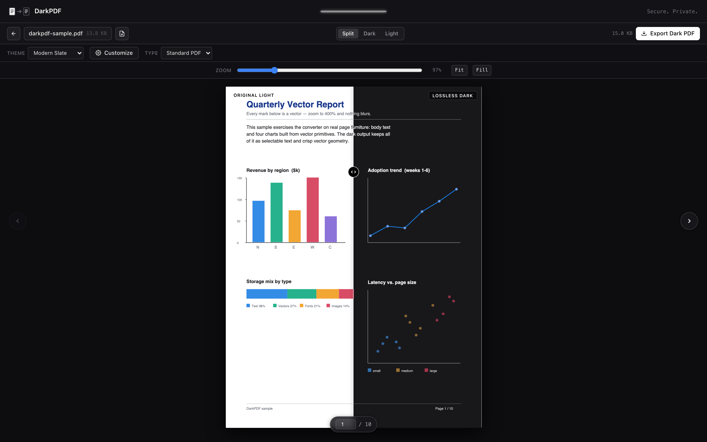
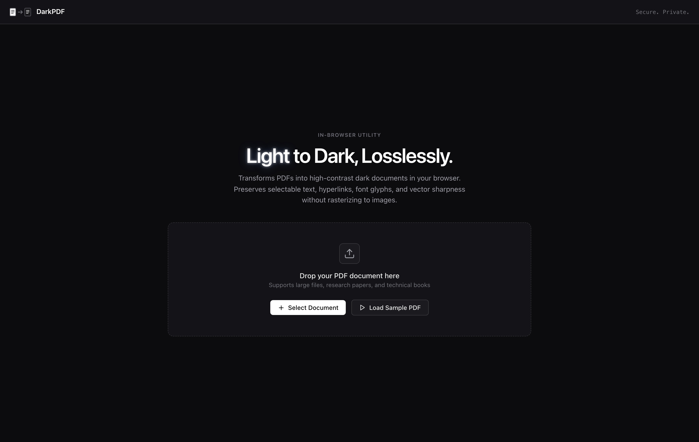
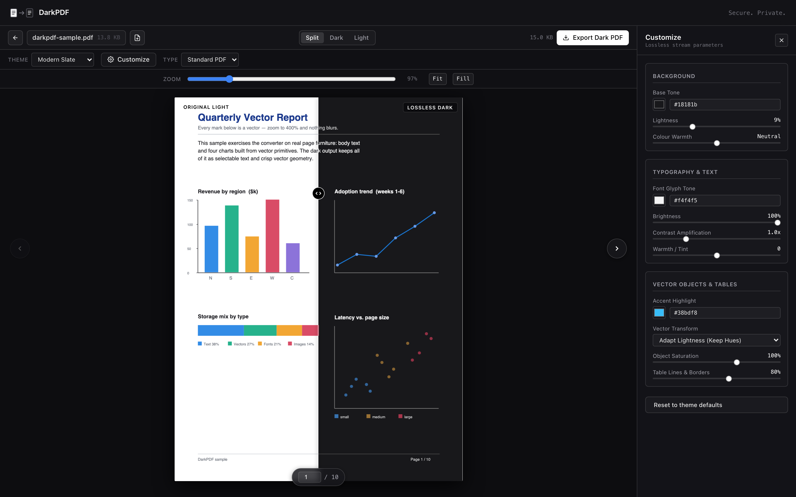

# DarkPDF — Lossless PDF Dark Mode (in the browser)

Convert a light PDF to dark **entirely in the browser** — no upload, no server,
no build step. Nothing is rasterised: the PDF's own structure is edited in
place, so text stays selectable text and vectors stay vectors.

**Live:** <https://darkpdf.riverakarom.com>

pdf-lib and pdf.js are bundled in `js/vendor/` — the app makes **zero
network requests** at runtime and runs fully offline. Stream re-compression
uses the platform `CompressionStream`, so nothing else is vendored. A strict
`Content-Security-Policy` is set in `index.html`.

<p align="center">
  
</p>

<p align="center">
  
  
</p>

The right panel above is the **Customize** drawer: every stream parameter the
converter uses is exposed as a live control, and the preview re-renders the real
converted PDF as you drag.

## What is preserved

The conversion changes **only colour**. Everything else is byte-for-byte:

- selectable / searchable text and native font programs
- link annotations and AcroForm fields
- vector graphics (crisp at any zoom)
- bookmarks / outline, document metadata, structure tree
- **raster images** — their streams are never read or rewritten

Indexed / Separation / DeviceN colours and pattern fills are left untouched
(their operands are ambiguous, so touching them would risk corruption).

Every conversion is verified against the original with pdf.js (page count,
per-page text, link annotations, form fields, image draws, bookmarks). It stays
silent unless something other than colour moved, in which case it warns.

## How it converts

One pass, lossless. It rewrites `rg/g/k` and `sc/scn` colour operators — device
*and* named/ICCBased colour spaces — in page content, Form XObjects, tiling
patterns and annotation appearance streams. Byte-splice edits; every non-colour
byte is kept, and the file is re-saved with object streams. Output runs
**~+8–18%** of the source. The whole-document pass runs in a Web Worker so a
large book never freezes the page.

## Themes

Slate (default), Midnight, Espresso — plus **Customize** for independent
background / text / object colour, background brightness & warmth, text
brightness / contrast / warmth, object saturation and thickness. Each section
has a revert control; **Reset All** returns everything to the theme. The preview
is WYSIWYG: it renders the real converted PDF, live.

## Using it

```bash
python3 -m http.server 8080      # any static server; then open http://localhost:8080
```

- Drop a PDF, or **Load Sample PDF**.
- **Split / Dark / Light** to compare; drag the divider in Split.
- **Zoom** auto-fits the page width and re-fits on resize / rotate; the slider
  (25–400%) is for close inspection — vectors stay sharp at any magnification,
  and the page scrolls inside its pane without the layout moving.
- The size chip by **Export Dark PDF** shows the estimated output size, then the
  real size once conversion finishes.

Responsive down to phone width (touch drag and zoom).

## Deploy

Static assets only — no backend, no build. The live site runs on Cloudflare
Workers static assets: `npx wrangler@4 deploy` from this folder. `.assetsignore`
keeps `tests/`, `README.md`, `docs/` and `LICENSE` out of the bundle. Any other
static host works too (GitHub Pages, Netlify drop, Nginx) — copy `index.html`,
`css/` and `js/`.

CJK PDFs: pdf.js character maps are not bundled (~1.3 MB). Most CJK PDFs embed
their fonts and render fine; to enable the fallback, drop `pdfjs-dist/cmaps/`
into `js/vendor/cmaps/` and set `window.__DARKPDF_HAS_CMAPS__ = true` before the
scripts in `index.html`.

## Architecture

| File | Role |
|------|------|
| `js/stream-parser.js` | Content-stream tokenizer + colour-operator remapper (byte-splice edits; skips strings, hex, inline images) |
| `js/converter.js` | Both modes; resource walking; colour-space classification; Flate re-compression |
| `js/retention.js` | Before/after integrity comparison |
| `js/viewer.js` | Dual-document renderer (original vs converted), split slider, fit-to-width + zoom, shared text layer |
| `js/app.js` | UI controller: customization, live preview + full-pass scheduling, size estimate, export |
| `css/styles.css` | Design system |
| `tests/` | Node test suite (no browser needed) |

## Tests

```bash
cd tests && for t in t*.js size_calibration.js; do node "$t"; done
```

12 suites / 126 assertions prove, against generated PDFs:

- the non-colour token stream is **byte-identical** after conversion — only colour changed
- text, link annotations, form fields and bookmarks survive conversion
- image XObject stream bytes are unchanged
- CMYK and `sc/scn` convert without corruption (no dangling operands, no crashes)
- inline-image binary and string-literal bytes are never spliced
- ICCBased colours are remapped while Indexed / Separation are left alone
- a 60-page document with a shared XObject converts in well under a second
- a wall-to-wall image page (cover / full-bleed scan) is left exactly as-is —
  no colour remap, no dark ground painted behind it
- the output-size estimate band contains the real result across four file sizes
